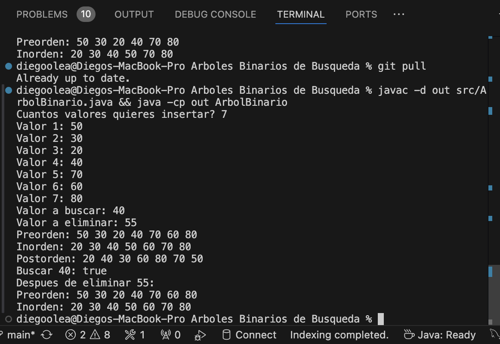
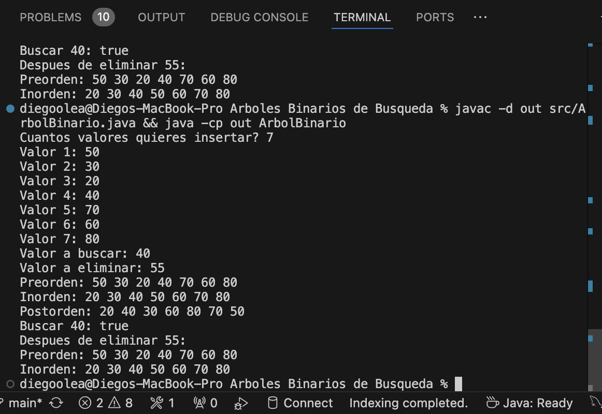
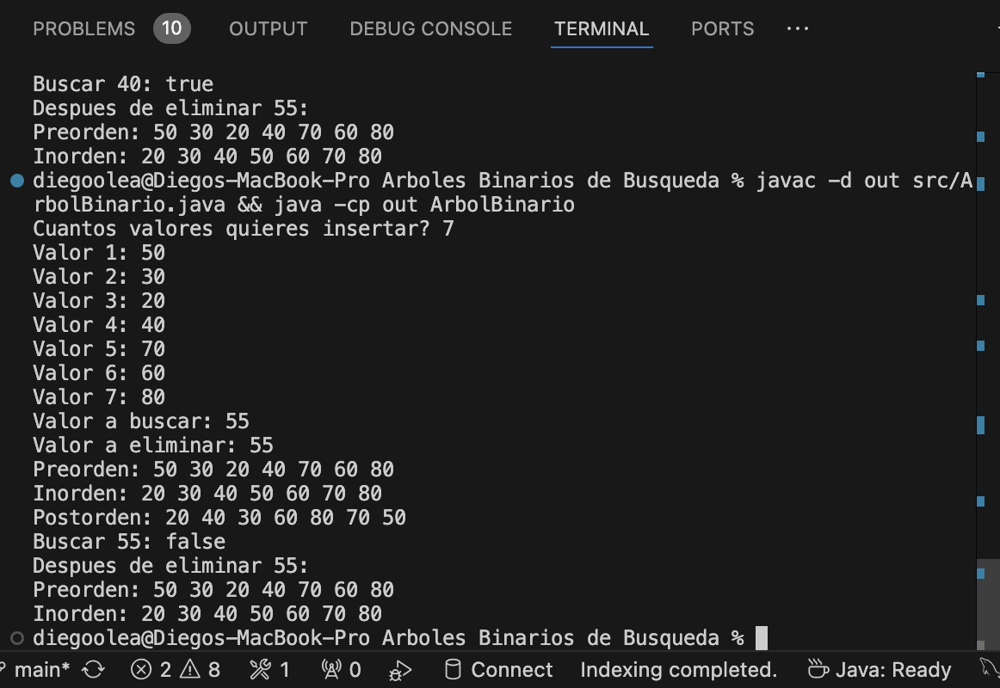
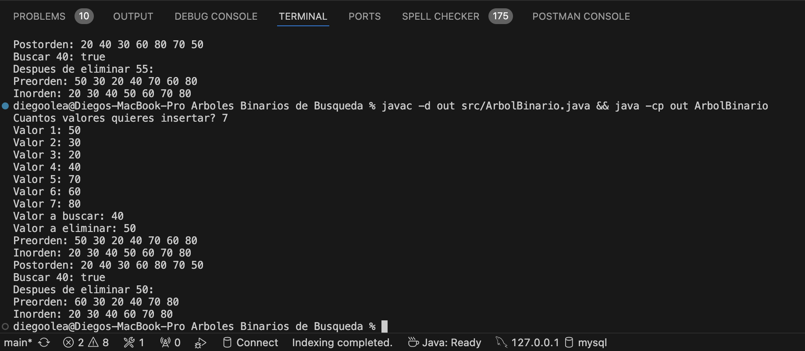
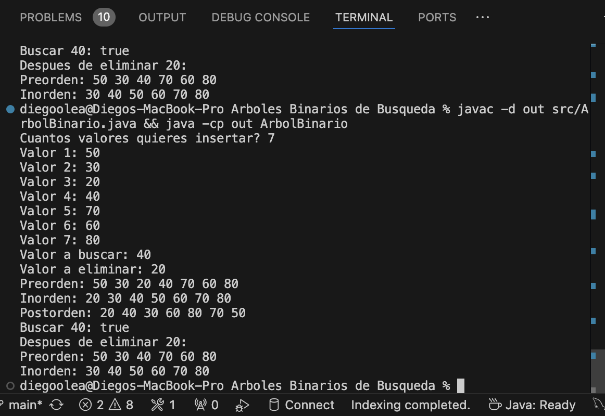
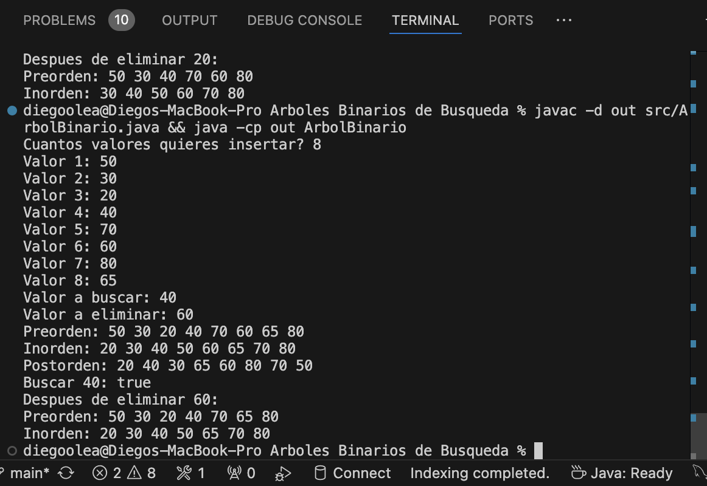
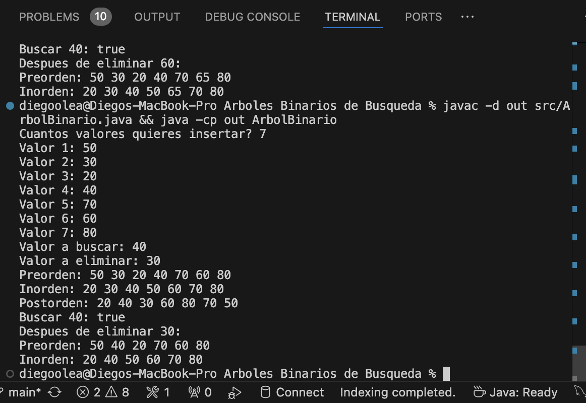
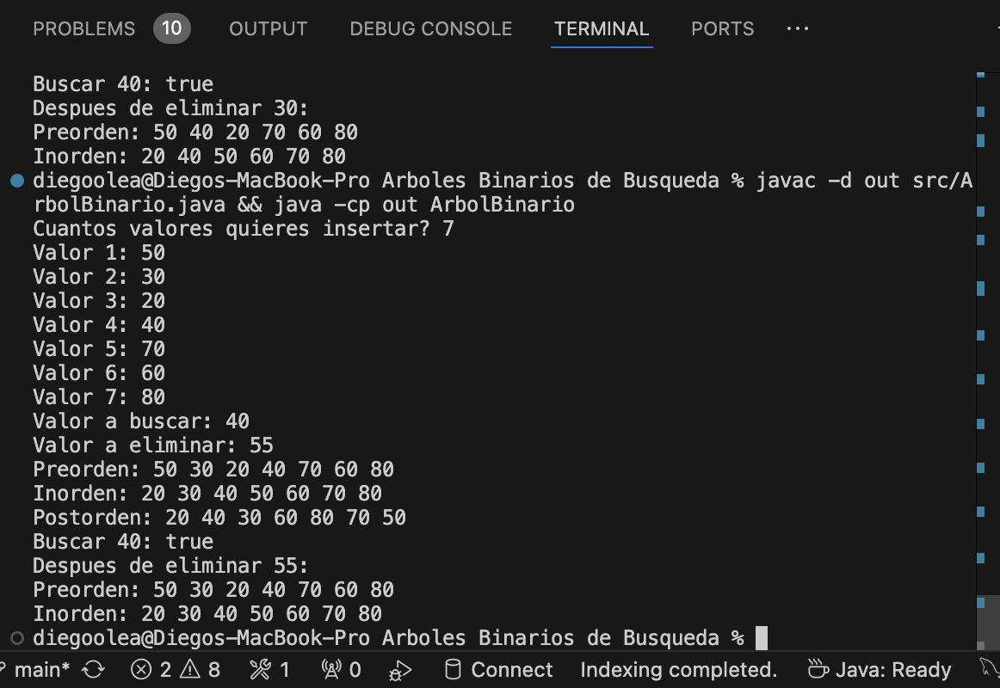

# Árboles Binarios de Búsqueda

Actividad de Estructura de Datos y Algoritmos.

Implementación de un Árbol Binario de Búsqueda (ABB) en Java con búsqueda, menor valor y eliminación, todos de forma **recursiva**.

## Reglas de la actividad

- Java puro, sin librerías externas, sin genéricos. Solo `int`.
- Todos los métodos nuevos son recursivos.
- `insertar()` y los recorridos no se reescriben.
- No se cambia la firma de los métodos públicos.

## Estructura

```
Arboles Binarios de Busqueda/
├── README.md
├── assets/              capturas de las pruebas
└── src/
    └── ArbolBinario.java
```

## Compilar y ejecutar

```bash
javac -d out src/ArbolBinario.java && java -cp out ArbolBinario
```

El programa pide en este orden:

1. Cuántos valores se van a insertar.
2. Cada uno de los valores.
3. El valor a buscar.
4. El valor a eliminar.

Después imprime los tres recorridos, el resultado de la búsqueda y el árbol después de eliminar.

---

## Fase 1. Código base

### Árbol de ejemplo

Insertando `50, 30, 20, 40, 70, 60, 80`:

```
            50
          /    \
        30      70
       /  \    /  \
     20   40  60   80
```

**Invariante del ABB:** todo lo que está a la izquierda de un nodo es menor que él y todo lo que está a la derecha es mayor (en este código los valores iguales también van a la derecha).

### `Nodo`

Cada nodo guarda:

- `info`: el valor entero.
- `izq`: referencia al hijo izquierdo.
- `der`: referencia al hijo derecho.

Si no tiene un hijo, la referencia vale `null`.

### Constructor

Inicializa `raiz = null` porque el árbol empieza vacío.

### `insertar(int info)`

1. Crea un nodo nuevo sin hijos.
2. Si el árbol está vacío, el nuevo nodo se vuelve la raíz.
3. Si no, baja desde la raíz con dos referencias: `actual` (el nodo que se revisa) y `anterior` (el padre). Si el valor es menor va a la izquierda, si es mayor o igual va a la derecha.
4. Cuando `actual` llega a `null`, conecta el nuevo nodo como hijo de `anterior`.

### Recorridos

Los tres son recursivos. El caso base es `nodo == null`. Solo cambia el momento en el que se imprime el nodo:

| Recorrido | Orden de visita | Salida |
|---|---|---|
| Inorden | Izquierda → Nodo → Derecha | `20 30 40 50 60 70 80` |
| Preorden | Nodo → Izquierda → Derecha | `50 30 20 40 70 60 80` |
| Postorden | Izquierda → Derecha → Nodo | `20 40 30 60 80 70 50` |

El inorden de un ABB siempre sale ordenado de menor a mayor.

### Prueba

Entrada: `7`, luego `50 30 20 40 70 60 80`.



---

## Fase 2. Búsqueda recursiva

### Casos

1. El nodo es `null` → no está, devuelve `false`. **Caso base.**
2. La clave es igual a la del nodo → la encontró, devuelve `true`. **Caso base.**
3. La clave es menor → solo puede estar a la izquierda, busca ahí.
4. La clave es mayor → solo puede estar a la derecha, busca ahí.

Nunca se buscan los dos lados: en cada paso se descarta la mitad del subárbol. Esa es la ventaja del ABB sobre recorrer todo.

### Código

```java
public boolean buscar(int clave) {
    return buscarRec(raiz, clave);
}

private boolean buscarRec(Nodo nodo, int clave) {
    if (nodo == null) {
        return false;
    }
    if (clave == nodo.info) {
        return true;
    }
    if (clave < nodo.info) {
        return buscarRec(nodo.izq, clave);
    } else {
        return buscarRec(nodo.der, clave);
    }
}
```

`buscar` es el método público: le pasa la raíz a `buscarRec`, que es el que hace la recursión.

### Ejemplo

- `buscar(40)`: 50 → izquierda → 30 → derecha → 40 → `true`.
- `buscar(55)`: 50 → derecha → 70 → izquierda → 60 → izquierda → `null` → `false`.

### Prueba

Entrada: `7`, `50 30 20 40 70 60 80`, buscar `40`.



Entrada: `7`, `50 30 20 40 70 60 80`, buscar `55`.



---

## Fase 3. Método auxiliar: menor valor

Va antes de la eliminación porque la eliminación lo necesita.

### Idea

Por la invariante del ABB, el menor valor de un subárbol está siempre en el **extremo izquierdo**. No hay que comparar nada, solo caminar a la izquierda hasta que ya no se pueda.

### Casos

1. El nodo no tiene hijo izquierdo → ese es el menor, devuelve su valor. **Caso base.**
2. Tiene hijo izquierdo → sigue bajando por la izquierda. **Caso recursivo.**

### Código

```java
private int minValor(Nodo nodo) {
    if (nodo.izq == null) {
        return nodo.info;
    }
    return minValor(nodo.izq);
}
```

### Ejemplo

`minValor(raiz.der)` empieza en 70 → tiene hijo izquierdo → baja a 60 → no tiene hijo izquierdo → devuelve **60**.

### Prueba

Se comprueba al eliminar la raíz `50`: su lugar lo toma `minValor(raiz.der)`, que es **60**.

Entrada: `7`, `50 30 20 40 70 60 80`, buscar `40`, eliminar `50`.



---

## Fase 4. Eliminación recursiva

Primero se **baja** hasta el nodo (igual que en la búsqueda) y luego se **resuelve** según cuántos hijos tenga.

### Casos

| Caso | Situación | Qué se hace |
|---|---|---|
| 0 | El nodo es `null` | La clave no existe, el árbol no cambia |
| 1 | Es hoja (sin hijos) | Se devuelve `null`: el padre lo suelta |
| 2 | Tiene un solo hijo | Se devuelve ese hijo: el padre se conecta directo con el nieto |
| 3 | Tiene dos hijos | Se reemplaza su valor por el sucesor y se borra el sucesor |

El **sucesor** es el menor valor del subárbol derecho (`minValor`). Es el único valor que puede ocupar ese lugar sin romper la invariante: es mayor que todo el subárbol izquierdo y menor que el resto del derecho.

### Código

```java
public void eliminar(int clave) {
    raiz = eliminarRec(raiz, clave);
}

private Nodo eliminarRec(Nodo nodo, int clave) {
    if (nodo == null) {
        return null;
    }
    if (clave < nodo.info) {
        nodo.izq = eliminarRec(nodo.izq, clave);
    } else if (clave > nodo.info) {
        nodo.der = eliminarRec(nodo.der, clave);
    } else {
        if (nodo.izq == null) {
            return nodo.der;
        }
        if (nodo.der == null) {
            return nodo.izq;
        }
        nodo.info = minValor(nodo.der);
        nodo.der = eliminarRec(nodo.der, nodo.info);
    }
    return nodo;
}
```

**Por qué el caso 1 no se escribe aparte:** si el nodo es hoja, `nodo.izq == null` es verdadero y devuelve `nodo.der`, que también es `null`. El mismo `if` cubre "sin hijos" y "solo hijo derecho".

**Por qué se reasigna `nodo.izq = eliminarRec(...)`:** el método devuelve el subárbol ya corregido, así que el padre lo tiene que volver a enlazar. Si solo se llama sin asignar, el árbol no cambia. Por lo mismo, `eliminar` hace `raiz = eliminarRec(raiz, clave)`: si se borra la raíz, el árbol necesita una nueva.

### Ejemplo: eliminar 30 (dos hijos)

```
Antes:                   Después:
        50                       50
      /    \                   /    \
    30      70               40      70
   /  \    /  \             /       /  \
 20   40  60   80         20      60   80
```

1. 30 es menor que 50 → izquierda.
2. Lo encontró. Tiene dos hijos.
3. `minValor` del subárbol derecho de 30 → 40.
4. El 30 se reemplaza por 40 y se borra el 40 original (es hoja, caso 1).

### Pruebas

**Caso 1 - Hoja.** Entrada: `7`, `50 30 20 40 70 60 80`, buscar `40`, eliminar `20`.
Resultado esperado: `Preorden: 50 30 40 70 60 80`



**Caso 2 - Un hijo.** El árbol original no tiene ningún nodo con un solo hijo, así que se agrega `65` (queda como hijo derecho de 60).
Entrada: `8`, `50 30 20 40 70 60 80 65`, buscar `40`, eliminar `60`.
Resultado esperado: `Preorden: 50 30 20 40 70 65 80`



**Caso 3 - Dos hijos.** Entrada: `7`, `50 30 20 40 70 60 80`, buscar `40`, eliminar `30`.
Resultado esperado: `Preorden: 50 40 20 70 60 80`



**Caso 0 - No existe.** Entrada: `7`, `50 30 20 40 70 60 80`, buscar `40`, eliminar `55`.
Resultado esperado: el árbol queda igual.



---

## Preguntas

Árbol construido con `50, 30, 20, 40, 70, 60, 80`.

### Árbol inicial

**2. ¿Qué propiedad debe cumplir todo Árbol Binario de Búsqueda?**

Todo lo que está a la izquierda de un nodo tiene que ser menor que él, y todo lo que está a la derecha tiene que ser mayor. Esto se cumple en cada nodo del árbol, no solo en la raíz.

**3. ¿Cuál es la raíz del árbol construido?**

El 50, porque fue el primer valor que se insertó.

**4. ¿Qué nodos son hojas?**

El 20, el 40, el 60 y el 80, porque ninguno tiene hijos.

**5. ¿Qué valores pertenecen al subárbol izquierdo de 50 y cuáles al derecho?**

Al izquierdo pertenecen 30, 20 y 40. Al derecho pertenecen 70, 60 y 80.

**6. ¿Qué secuencia esperas obtener con el recorrido inorden?**

20, 30, 40, 50, 60, 70, 80. Sale ordenado de menor a mayor.

### 7. Método de búsqueda

**¿Por qué no es necesario recorrer todos los nodos del árbol para buscar una clave?**

Porque en cada nodo comparo el número que busco y con eso ya sé si tengo que ir a la izquierda o a la derecha. El otro lado lo puedo ignorar completo, entonces en cada paso me ahorro la mitad del camino.

**Si se busca 40, ¿qué nodos se visitan y en qué orden?**

Primero el 50, luego el 30 y al final el 40, que es donde lo encuentro.

**Si se busca 90, ¿qué condición permitirá concluir que no existe?**

Se pasa por el 50, el 70 y el 80, y como 90 es mayor que 80 tendría que seguir a la derecha, pero ahí ya no hay nada. Llegar a un lugar vacío es lo que me dice que no existe.

**¿Qué valor booleano debe regresar el caso base cuando el nodo actual es null?**

Debe regresar falso, porque si llegué a un lugar vacío significa que el número no está en el árbol.

**¿Qué ocurriría si el árbol no respetara la regla menor-izquierda y mayor-derecha?**

La búsqueda se podría ir por el lado equivocado y decir que un número no está aunque sí esté. Para estar seguro tendría que revisar todo el árbol, y se perdería la ventaja de usar un ABB.

### 8. Menor valor

**¿Hacia qué dirección debes desplazarte para encontrar el mínimo?**

Hacia la izquierda, porque ahí siempre están los valores más chicos.

**¿Qué condición indica que ya encontraste el nodo mínimo?**

Cuando el nodo ya no tiene hijo a la izquierda. Si no hay nada más a la izquierda, no hay ningún número más chico que él.

**¿Cuál es el mínimo del subárbol cuya raíz es 70 en el árbol inicial?**

El 60, porque es el hijo izquierdo de 70 y ya no tiene nada a su izquierda.

### 9. Eliminación

**¿Por qué la eliminación requiere más casos que la búsqueda?**

Porque en la búsqueda solo veo si el número está o no, y el árbol no cambia. Al eliminar además tengo que acomodar el árbol para que no se rompa, y la forma de hacerlo depende de cuántos hijos tenga el nodo que quito.

**¿Qué debe ocurrir si la clave que se desea eliminar no existe?**

Nada, el árbol se queda exactamente igual.

**¿Por qué eliminar un nodo hoja es el caso más sencillo?**

Porque no tiene nada colgando debajo. Solo hay que soltarlo del padre y no se pierde nada más.

**Si un nodo tiene solamente un hijo, ¿por qué puede devolverse directamente la referencia a ese hijo?**

Porque ese hijo y todo lo que tiene debajo ya estaban del lado correcto respecto al padre del nodo que se borra. Entonces puede subir y ocupar su lugar sin desordenar nada.

**¿Por qué el menor valor del subárbol derecho es un candidato adecuado para sustituir a un nodo con dos hijos?**

Porque es más grande que todo lo que está a la izquierda y más chico que todo lo demás que está a la derecha. Es el único número que puede quedar en ese lugar sin romper el orden del árbol.

**Después de copiar el valor sustituto, ¿por qué todavía es necesario eliminar ese valor de su ubicación original?**

Porque si no, ese número quedaría dos veces en el árbol, una en el lugar nuevo y otra en el lugar de donde salió.

**¿Qué riesgo existiría si se eliminara un nodo con dos hijos sin reconectar correctamente sus subárboles?**

Se podrían perder partes completas del árbol, porque nada apuntaría a ellas. También podría quedar desordenado y las búsquedas ya no funcionarían bien.

**¿Por qué eliminar la raíz puede modificar la variable raiz del árbol?**

Porque si quito la raíz otro nodo tiene que ocupar su lugar, y el árbol necesita saber cuál es su nuevo punto de inicio. Si es el único nodo, el árbol se queda vacío.

**¿Qué propiedad debe seguir cumpliendo el árbol después de cualquier eliminación?**

La misma de siempre, menores a la izquierda y mayores a la derecha en todos los nodos.

### 10. Reflexiones finales

**¿Cómo ayuda el recorrido inorden a comprobar que el ABB conserva su estructura?**

Si después de insertar o eliminar el inorden sigue saliendo ordenado de menor a mayor, sé que el árbol sigue bien acomodado. Si algún número sale fuera de orden, algo se rompió.

**Explica con tus palabras el caso de eliminación que consideraste más difícil.**

El más difícil fue cuando el nodo tiene dos hijos, porque no se puede quitar y ya, ya que alguno de los dos lados se quedaría sin padre. Lo que se hace es buscar el número más chico del lado derecho, ponerlo en el lugar del que quiero borrar y después borrar ese número de donde estaba. Al principio me costó entender por qué se elegía ese número, hasta que vi que es el único que deja todo en orden.

**¿Qué papel cumple la recursividad en los métodos de búsqueda y eliminación?**

Permite que el método se llame a sí mismo con un pedazo más chico del árbol, y así va bajando nodo por nodo hasta encontrar el número o llegar a un lugar vacío. Hace que el código sea corto y que se parezca a cómo uno lo resolvería a mano.

**¿Qué aprendiste sobre el cambio de referencias entre nodos al eliminar elementos?**

Que eliminar en realidad es cambiar a quién apunta el padre. El nodo no se borra solo, deja de estar conectado. Por eso es importante que el padre guarde lo que regresa el método, porque si no se reconecta el árbol no cambia o se pierden nodos.

**Si tuvieras que explicar a un compañero la diferencia entre buscar y eliminar en un ABB, ¿qué le dirías?**

Que buscar solo es mirar, bajas comparando hasta encontrar el número o llegar a un lugar vacío y el árbol no se toca. Eliminar empieza igual, pero cuando encuentras el número tienes que quitarlo y volver a acomodar el árbol para que siga ordenado.
