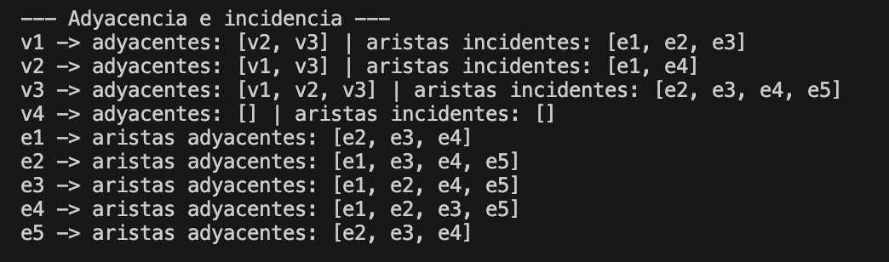

# Grafos no dirigidos

Actividad de Estructura de Datos y Algoritmos.

Programa en Java que modela un **grafo no dirigido** G = (V, E) y hace el análisis completo de sus propiedades fundamentales:

1. Crear grafos con vértices y aristas (incluyendo bucles y aristas paralelas).
2. Generar la tabla de función punto extremo-arista.
3. Identificar la terminología: adyacencia, incidencia, bucles, aristas paralelas y vértices aislados.
4. Calcular el grado de cada vértice (los bucles cuentan doble).

## Reglas de la actividad

- Máximo 3 clases: `Vertice`, `Arista` y `Grafo`.
- Implementar los atributos y métodos del diagrama UML.
- Cada clase tiene constructor vacío, constructor parametrizado, getters/setters y `toString()`.

## Estructura

```
Grafos no dirigidos/
├── README.md
├── assets/          capturas de las pruebas
├── Vertice.java
├── Arista.java
└── Grafo.java       incluye el main con el ejemplo
```

## Compilar y ejecutar

```bash
javac *.java && java Grafo
```

El programa no pide datos. El `main` arma un grafo de ejemplo e imprime el análisis completo.

---

## Grafo de ejemplo

```java
Vertice v1 = new Vertice("v1", 1);
Vertice v2 = new Vertice("v2", 2);
Vertice v3 = new Vertice("v3", 3);
Vertice v4 = new Vertice("v4", 4);

g.agregarArista(new Arista("e1", 1, v1, v2));
g.agregarArista(new Arista("e2", 2, v1, v3));
g.agregarArista(new Arista("e3", 3, v1, v3));
g.agregarArista(new Arista("e4", 4, v2, v3));
g.agregarArista(new Arista("e5", 5, v3, v3));
```

```
          v1
         /  \
       e1    e2, e3
       /      \
     v2 --e4-- v3 (e5: bucle)

     v4 (aislado)
```

- `e2` y `e3` unen los mismos vértices (v1 y v3), así que son **paralelas**.
- `e5` empieza y termina en v3, así que es un **bucle**.
- `v4` no tiene ninguna arista, así que queda **aislado**.

---

## Fase 1. Clase `Vertice`

Representa un nodo del grafo, un elemento del conjunto V(G).

```java
private String nombre;
private int id;
private int grado;
private boolean esAislado;
```

- `nombre`: nombre del vértice, por ejemplo `"v1"`.
- `id`: identificador numérico único.
- `grado`: grado del vértice. No se calcula aquí, lo calcula la clase `Grafo`.
- `esAislado`: `true` si ninguna arista incide en él.

```java
public Vertice() {
    nombre = "";
    id = 0;
    grado = 0;
    esAislado = true;
}

public Vertice(String nombre, int id) {
    this.nombre = nombre;
    this.id = id;
    grado = 0;
    esAislado = true;
}
```

El constructor vacío deja todo en valores por defecto. El parametrizado recibe nombre e id. En los dos el grado empieza en 0 y el vértice empieza aislado, porque todavía no tiene aristas.

```java
@Override
public String toString() {
    String texto = nombre + " (grado: " + grado + ")";
    if (esAislado) {
        texto += " [AISLADO]";
    }
    return texto;
}
```

Regresa `"v1 (grado: 3)"`. Si el vértice es aislado agrega `[AISLADO]` al final: `"v4 (grado: 0) [AISLADO]"`. El resto de la clase son getters y setters.

---

## Fase 2. Clase `Arista`

Representa una conexión entre dos vértices, un elemento del conjunto E(G).

```java
private String nombre;
private int id;
private Vertice extremo1;
private Vertice extremo2;
private boolean esBucle;
```

- `nombre` e `id`: igual que en el vértice, por ejemplo `"e1"` y `1`.
- `extremo1` y `extremo2`: los dos vértices que une la arista.
- `esBucle`: `true` si los dos extremos son el mismo vértice.

```java
public Arista(String nombre, int id, Vertice extremo1, Vertice extremo2) {
    this.nombre = nombre;
    this.id = id;
    this.extremo1 = extremo1;
    this.extremo2 = extremo2;
    esBucle = (extremo1 == extremo2);
}
```

El constructor parametrizado guarda los datos y **decide solo si es bucle**: si `extremo1` y `extremo2` son el mismo vértice, `esBucle` queda en `true`. El constructor vacío deja todo en `""`, `0`, `null` y `false`.

```java
public boolean esParalela(Arista otra) {
    if (this.id == otra.id) {
        return false;
    }
    boolean mismoOrden = (this.extremo1 == otra.extremo1 && this.extremo2 == otra.extremo2);
    boolean ordenInverso = (this.extremo1 == otra.extremo2 && this.extremo2 == otra.extremo1);
    return mismoOrden || ordenInverso;
}
```

Dos aristas son paralelas si son distintas y tienen los mismos extremos.

1. Si tienen el mismo id es la misma arista, entonces no cuenta como paralela.
2. Como el grafo no es dirigido, `{v1, v3}` es lo mismo que `{v3, v1}`. Por eso se revisan los dos órdenes.

```java
public boolean incideEn(Vertice v) {
    return extremo1 == v || extremo2 == v;
}
```

Una arista incide en cada uno de sus extremos. Regresa `true` si `v` es uno de los dos.

```java
public String extremosTexto() {
    if (esBucle) {
        return "{" + extremo1.getNombre() + "} [BUCLE]";
    }
    return "{" + extremo1.getNombre() + ", " + extremo2.getNombre() + "}";
}
```

Arma el texto de los extremos: `"{v1, v2}"` para una arista normal y `"{v3} [BUCLE]"` para un bucle, donde solo se muestra un extremo. Lo usan `toString()` (`"e1: {v1, v2}"`) y la tabla de la Fase 6.

---

## Fase 3. Clase `Grafo`: construcción

```java
private String nombre;
private ArrayList<Vertice> vertices;
private ArrayList<Arista> aristas;
private int gradoTotal;
```

- `vertices`: el conjunto V(G).
- `aristas`: el conjunto E(G).
- `gradoTotal`: la suma de los grados de todos los vértices.

```java
public Grafo(String nombre) {
    this.nombre = nombre;
    vertices = new ArrayList<>();
    aristas = new ArrayList<>();
    gradoTotal = 0;
}

public void agregarVertice(Vertice v) {
    vertices.add(v);
}

public void agregarArista(Arista a) {
    aristas.add(a);
}
```

El constructor crea las dos listas vacías. `agregarVertice` y `agregarArista` solo meten el elemento en su lista. `toString()` regresa `"Grafo G: |V| = 4, |E| = 5"`.

---

## Fase 4. Grado de los vértices

```java
public int calcularGrado(Vertice v) {
    int grado = 0;
    for (Arista a : aristas) {
        if (a.esBucle() && a.getExtremo1() == v) {
            grado += 2;
        } else if (!a.esBucle() && a.incideEn(v)) {
            grado += 1;
        }
    }
    v.setGrado(grado);
    v.setEsAislado(grado == 0);
    return grado;
}
```

Recorre todas las aristas y aplica la **regla clave**:

- Si la arista es un bucle en `v` suma **2**, porque el bucle toca dos veces al vértice.
- Si no es bucle pero incide en `v` suma **1**.

Al final guarda el grado en el vértice y lo marca como aislado si quedó en 0.

```java
public int calcularGradoTotal() {
    gradoTotal = 0;
    for (Vertice v : vertices) {
        gradoTotal += calcularGrado(v);
    }
    return gradoTotal;
}
```

Calcula el grado de cada vértice y los suma.

Con el ejemplo:

- `v1` tiene e1, e2 y e3 → grado **3**.
- `v2` tiene e1 y e4 → grado **2**.
- `v3` tiene e2, e3 y e4, más el bucle e5 que vale 2 → 3 + 2 = **5**.
- `v4` no tiene aristas → grado **0**, aislado.
- Grado total: 3 + 2 + 5 + 0 = **10**.

### Prueba


---

## Fase 5. Terminología

Todos estos métodos siguen la misma idea: recorrer una lista y quedarse con los elementos que cumplen la condición.

### Vértices adyacentes

```java
public ArrayList<Vertice> obtenerAdyacentes(Vertice v) {
    ArrayList<Vertice> adyacentes = new ArrayList<>();
    for (Arista a : aristas) {
        if (!a.incideEn(v)) {
            continue;
        }
        Vertice otro;
        if (a.esBucle()) {
            otro = v;
        } else if (a.getExtremo1() == v) {
            otro = a.getExtremo2();
        } else {
            otro = a.getExtremo1();
        }
        if (!adyacentes.contains(otro)) {
            adyacentes.add(otro);
        }
    }
    return adyacentes;
}
```

Dos vértices son adyacentes si una arista los une.

1. Se salta las aristas que no tocan a `v`.
2. Si es bucle, el vértice adyacente es el mismo `v`.
3. Si no, el adyacente es el **otro** extremo de la arista.
4. Con `contains` evita repetidos. Por eso v1 sale una sola vez en los adyacentes de v3 aunque e2 y e3 los unan a los dos.

Ejemplo: adyacentes a v3 → `[v1, v2, v3]`. v3 aparece por su bucle.

### Aristas incidentes

```java
for (Arista a : aristas) {
    if (a.incideEn(v)) {
        incidentes.add(a);
    }
}
```

Guarda las aristas que tienen a `v` como extremo. Ejemplo: incidentes en v3 → `[e2, e3, e4, e5]`.

### Aristas adyacentes

```java
for (Arista b : aristas) {
    if (b != a && (b.incideEn(a.getExtremo1()) || b.incideEn(a.getExtremo2()))) {
        adyacentes.add(b);
    }
}
```

Dos aristas son adyacentes si comparten al menos un extremo. `b != a` evita que una arista salga como adyacente a sí misma. Ejemplo: adyacentes a e1 → `[e2, e3, e4]`.

### Bucles

```java
for (Arista a : aristas) {
    if (a.esBucle()) {
        bucles.add(a);
    }
}
```

Guarda las aristas que son bucle. Ejemplo: `[e5]`.

### Aristas paralelas

```java
for (int i = 0; i < aristas.size(); i++) {
    for (int j = i + 1; j < aristas.size(); j++) {
        Arista a = aristas.get(i);
        Arista b = aristas.get(j);
        if (a.esParalela(b)) {
            paralelas.add("{" + a.getNombre() + ", " + b.getNombre() + "}");
        }
    }
}
```

Compara cada par de aristas con `esParalela`. El segundo `for` empieza en `i + 1` para no comparar una arista consigo misma ni repetir el mismo par al revés. Ejemplo: `[{e2, e3}]`.

### Vértices aislados

```java
for (Vertice v : vertices) {
    if (v.esAislado()) {
        aislados.add(v);
    }
}
```

Guarda los vértices con grado 0. Necesita que antes se haya llamado `calcularGradoTotal()`, porque ahí se actualiza `esAislado`. Ejemplo: `[v4]`.

### Prueba

Adyacencia e incidencia:



Bucles, aristas paralelas y vértices aislados:


---

## Fase 6. Tabla de función punto extremo-arista

```java
public void mostrarTablaExtremos() {
    System.out.println("\n--- Tabla Punto Extremo - Arista ---");
    System.out.printf("| %-8s | %-22s |%n", "Arista", "Punto(s) Extremo(s)");
    System.out.println("|----------|------------------------|");
    for (Arista a : aristas) {
        System.out.printf("| %-8s | %-22s |%n", a.getNombre(), a.extremosTexto());
    }
}
```

Imprime el encabezado y después una fila por cada arista con su nombre y sus extremos. `%-8s` y `%-22s` rellenan con espacios para que las columnas queden alineadas. Para los bucles `extremosTexto()` ya agrega `[BUCLE]`.

### Prueba


---

## Fase 7. Teoremas

### Teorema del Saludo de Mano

```java
public boolean verificarTeoremaSaludo() {
    return calcularGradoTotal() == 2 * aristas.size();
}
```

La suma de los grados de todos los vértices es igual al doble del número de aristas, porque cada arista aporta 2 al grado total: 1 por cada extremo, o 2 al mismo vértice si es bucle.

Con el ejemplo: grado total = 10 y 2 × 5 aristas = 10 → **se cumple**.

### ¿Puede existir un grafo con estos grados?

```java
public boolean puedeExistirGrafo(int[] grados) {
    int suma = 0;
    for (int g : grados) {
        if (g < 0) {
            return false;
        }
        suma += g;
    }
    return suma % 2 == 0;
}
```

Por el **Corolario 10.1.2**, el grado total de un grafo siempre es par. Entonces un grafo con ciertos grados solo puede existir si ningún grado es negativo y la suma es par.

- `{3, 2, 5, 0}` → suma 10, par → `true`.
- `{3, 2, 2}` → suma 7, impar → `false`.

### Prueba


---

## Fase 8. Análisis completo y `main`

```java
public static void main(String[] args) {
    Grafo g = new Grafo("G");
    // se crean v1..v4 y e1..e5 como en el grafo de ejemplo
    g.mostrarAnalisisCompleto();

    System.out.println("{3, 2, 5, 0}: " + g.puedeExistirGrafo(new int[]{3, 2, 5, 0}));
    System.out.println("{3, 2, 2}:    " + g.puedeExistirGrafo(new int[]{3, 2, 2}));
}
```

El `main` está dentro de `Grafo` para no usar una cuarta clase. Crea el grafo de ejemplo, llama a `mostrarAnalisisCompleto()` y al final prueba `puedeExistirGrafo` con dos listas de grados.

`mostrarAnalisisCompleto()` junta todo en un solo reporte, en este orden:

1. Nombre del grafo con |V| y |E|.
2. Tabla punto extremo-arista.
3. Grado de cada vértice.
4. Adyacencia e incidencia de cada vértice y aristas adyacentes de cada arista.
5. Bucles, aristas paralelas y vértices aislados.
6. Verificación del Teorema del Saludo de Mano.

### Prueba


