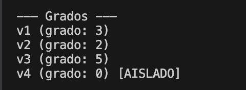
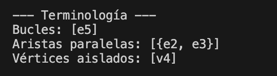
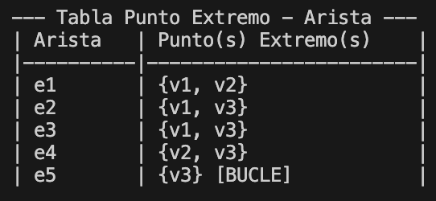
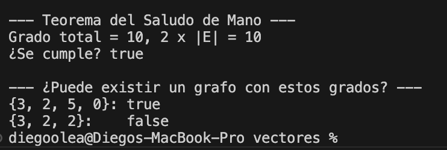
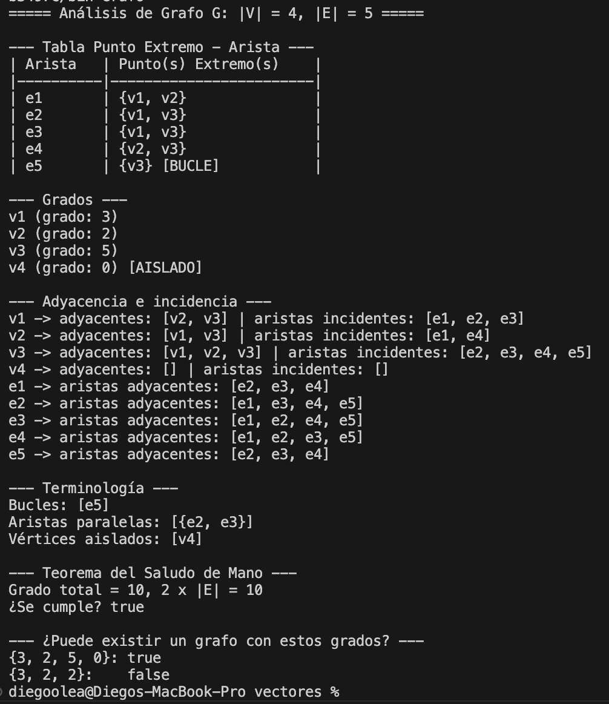

# Grafos no dirigidos

Actividad de Estructura de Datos y Algoritmos.

Programa en Java que modela un **grafo no dirigido** G = (V, E) y hace el análisis completo de sus propiedades fundamentales:

1. Crear grafos con vértices y aristas (incluyendo bucles y aristas paralelas).
2. Generar la tabla de función punto extremo-arista.
3. Identificar la terminología: adyacencia, incidencia, bucles, aristas paralelas y vértices aislados.
4. Calcular el grado de cada vértice (los bucles cuentan doble).

## Reglas de la actividad

- Máximo 3 clases: `Vertice`, `Arista` y `Grafo`.
- Implementar los atributos y métodos del diagrama UML.
- Cada clase tiene constructor vacío, constructor parametrizado, getters/setters y `toString()`.

## Estructura

```
Grafos no dirigidos/
├── README.md
├── assets/          capturas de las pruebas
├── Vertice.java
├── Arista.java
└── Grafo.java       incluye el main con el ejemplo
```

## Compilar y ejecutar

```bash
javac *.java && java Grafo
```

El programa no pide datos. El `main` arma un grafo de ejemplo e imprime el análisis completo.

---

## Grafo de ejemplo

Vértices: `v1, v2, v3, v4`

| Arista | Extremos | Observación |
|---|---|---|
| e1 | {v1, v2} | |
| e2 | {v1, v3} | paralela a e3 |
| e3 | {v1, v3} | paralela a e2 |
| e4 | {v2, v3} | |
| e5 | {v3} | bucle |

`v4` no tiene aristas, así que queda aislado.

```
          v1
         /  \
       e1    e2, e3
       /      \
     v2 --e4-- v3 (e5: bucle)

     v4 (aislado)
```

---

## Fase 1. Clase `Vertice`

Representa un nodo del grafo, un elemento del conjunto V(G).

### Atributos

| Atributo | Tipo | Para qué sirve |
|---|---|---|
| `nombre` | `String` | Nombre del vértice, por ejemplo `"v1"` |
| `id` | `int` | Identificador numérico único |
| `grado` | `int` | Grado del vértice, lo calcula la clase `Grafo` |
| `esAislado` | `boolean` | `true` si ninguna arista incide en él |

### Constructores

- `Vertice()`: deja `nombre = ""`, `id = 0`, `grado = 0` y `esAislado = true`.
- `Vertice(nombre, id)`: asigna nombre e id. El grado empieza en 0 y el vértice empieza aislado, porque todavía no tiene aristas.

### Métodos

- Getters y setters de cada atributo.
- `toString()` regresa `"v1 (grado: 3)"`, y si el vértice es aislado agrega `[AISLADO]`: `"v4 (grado: 0) [AISLADO]"`.

```java
Vertice v1 = new Vertice("v1", 1);
```

---

## Fase 2. Clase `Arista`

Representa una conexión entre dos vértices, un elemento del conjunto E(G).

### Atributos

| Atributo | Tipo | Para qué sirve |
|---|---|---|
| `nombre` | `String` | Nombre de la arista, por ejemplo `"e1"` |
| `id` | `int` | Identificador numérico único |
| `extremo1` | `Vertice` | Primer punto extremo |
| `extremo2` | `Vertice` | Segundo punto extremo |
| `esBucle` | `boolean` | `true` si los dos extremos son el mismo vértice |

### Constructores

- `Arista()`: todo en valores por defecto (`""`, `0`, `null`, `null`, `false`).
- `Arista(nombre, id, extremo1, extremo2)`: asigna los datos y **decide solo si es bucle**:

```java
esBucle = (extremo1 == extremo2);
```

### `esParalela(Arista otra)`

Dos aristas son paralelas si son distintas y tienen los mismos extremos. Como el grafo no es dirigido, `{v1, v3}` es lo mismo que `{v3, v1}`, por eso se revisan los dos órdenes:

```java
if (this.id == otra.id) {
    return false;
}
boolean mismoOrden = (this.extremo1 == otra.extremo1 && this.extremo2 == otra.extremo2);
boolean ordenInverso = (this.extremo1 == otra.extremo2 && this.extremo2 == otra.extremo1);
return mismoOrden || ordenInverso;
```

La primera condición evita que una arista salga como paralela a sí misma.

### `incideEn(Vertice v)`

Una arista incide en cada uno de sus extremos. Regresa `true` si `v` es `extremo1` o `extremo2`.

### `toString()` y `extremosTexto()`

- Arista normal: `"e1: {v1, v2}"`
- Bucle: `"e5: {v3} [BUCLE]"` (solo se muestra un extremo)

`extremosTexto()` arma solo la parte de los extremos y también la usa la tabla de la Fase 6.

---

## Fase 3. Clase `Grafo`: construcción

### Atributos

| Atributo | Tipo | Para qué sirve |
|---|---|---|
| `nombre` | `String` | Nombre del grafo |
| `vertices` | `ArrayList<Vertice>` | Conjunto V(G) |
| `aristas` | `ArrayList<Arista>` | Conjunto E(G) |
| `gradoTotal` | `int` | Suma de los grados de todos los vértices |

### Constructores y métodos de construcción

- `Grafo()` y `Grafo(nombre)` crean las dos listas vacías y ponen `gradoTotal = 0`.
- `agregarVertice(v)` agrega el vértice a `vertices`.
- `agregarArista(a)` agrega la arista a `aristas`.
- `toString()` regresa `"Grafo G: |V| = 4, |E| = 5"`.

---

## Fase 4. Grado de los vértices

### `calcularGrado(Vertice v)`

Recorre todas las aristas y aplica la **regla clave**:

- Si la arista es un bucle en `v` → suma **2** (el bucle toca dos veces al vértice).
- Si no es bucle pero incide en `v` → suma **1**.

```java
for (Arista a : aristas) {
    if (a.esBucle() && a.getExtremo1() == v) {
        grado += 2;
    } else if (!a.esBucle() && a.incideEn(v)) {
        grado += 1;
    }
}
v.setGrado(grado);
v.setEsAislado(grado == 0);
```

Al final guarda el grado en el vértice y lo marca como aislado si quedó en 0.

### `calcularGradoTotal()`

Llama a `calcularGrado` para cada vértice y suma los resultados.

### Resultado con el ejemplo

| Vértice | Aristas | Grado |
|---|---|---|
| v1 | e1, e2, e3 | 3 |
| v2 | e1, e4 | 2 |
| v3 | e2, e3, e4 + bucle e5 (×2) | 3 + 2 = **5** |
| v4 | ninguna | 0 [AISLADO] |
| | **Grado total** | **10** |

### Prueba



---

## Fase 5. Terminología

Todos estos métodos siguen la misma idea: recorrer una lista y quedarse con los elementos que cumplen la condición.

| Método | Qué regresa | Condición |
|---|---|---|
| `obtenerAdyacentes(v)` | Vértices adyacentes a `v` | Están unidos a `v` por una arista. Si `v` tiene un bucle, `v` es adyacente a sí mismo. No se repiten. |
| `obtenerAristasIncidentes(v)` | Aristas que inciden en `v` | `a.incideEn(v)` |
| `obtenerAristasAdyacentes(a)` | Aristas adyacentes a `a` | Son distintas de `a` y comparten al menos un extremo con ella |
| `obtenerBucles()` | Aristas que son bucles | `a.esBucle()` |
| `obtenerParalelas()` | Pares de aristas paralelas, como `"{e2, e3}"` | `esParalela`, con un doble `for` donde el segundo empieza en `i + 1` para no repetir pares |
| `obtenerVerticesAislados()` | Vértices aislados | `v.esAislado()`. Necesita que antes se haya llamado `calcularGradoTotal()` |

### Resultado con el ejemplo

- Adyacentes a v3: `[v1, v2, v3]` (v3 aparece por su bucle).
- Aristas incidentes en v3: `[e2, e3, e4, e5]`.
- Aristas adyacentes a e1: `[e2, e3, e4]`.
- Bucles: `[e5]`.
- Aristas paralelas: `[{e2, e3}]`.
- Vértices aislados: `[v4]`.

### Prueba



---

## Fase 6. Tabla de función punto extremo-arista

`mostrarTablaExtremos()` imprime cada arista con sus extremos, usando `printf` para alinear las columnas:

```
| Arista   | Punto(s) Extremo(s)    |
|----------|------------------------|
| e1       | {v1, v2}               |
| e2       | {v1, v3}               |
| e3       | {v1, v3}               |
| e4       | {v2, v3}               |
| e5       | {v3} [BUCLE]           |
```

### Prueba



---

## Fase 7. Teoremas

### `verificarTeoremaSaludo()`

**Teorema del Saludo de Mano:** la suma de los grados de todos los vértices es igual al doble del número de aristas, porque cada arista aporta 2 al grado total (1 por cada extremo, o 2 al mismo vértice si es bucle).

```java
return calcularGradoTotal() == 2 * aristas.size();
```

Con el ejemplo: grado total = 10 y 2 × |E| = 2 × 5 = 10 → **se cumple**.

### `puedeExistirGrafo(int[] grados)`

**Corolario 10.1.2:** el grado total de un grafo siempre es par. Entonces un grafo con ciertos grados solo puede existir si ningún grado es negativo y la suma es par.

- `{3, 2, 5, 0}` → suma 10, par → `true`.
- `{3, 2, 2}` → suma 7, impar → `false`.

### Prueba



---

## Fase 8. Análisis completo y `main`

`mostrarAnalisisCompleto()` junta todo en un solo reporte, en este orden:

1. Nombre del grafo con |V| y |E|.
2. Tabla punto extremo-arista.
3. Grado de cada vértice.
4. Adyacencia e incidencia de cada vértice y aristas adyacentes de cada arista.
5. Bucles, aristas paralelas y vértices aislados.
6. Verificación del Teorema del Saludo de Mano.

El `main` (dentro de `Grafo`) crea los vértices y aristas del ejemplo, llama a `mostrarAnalisisCompleto()` y al final prueba `puedeExistirGrafo` con dos listas de grados.

```java
Grafo g = new Grafo("G");
Vertice v1 = new Vertice("v1", 1);
g.agregarVertice(v1);
g.agregarArista(new Arista("e1", 1, v1, v2));
g.agregarArista(new Arista("e5", 5, v3, v3));
g.mostrarAnalisisCompleto();
```

### Prueba


