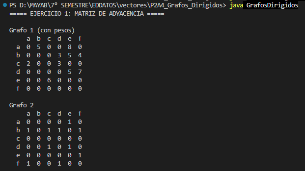
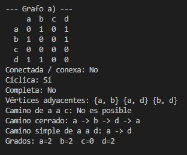
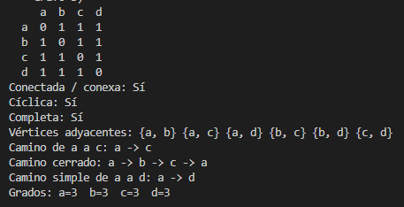
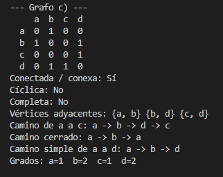
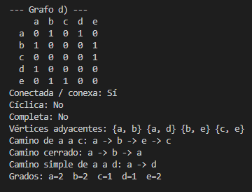
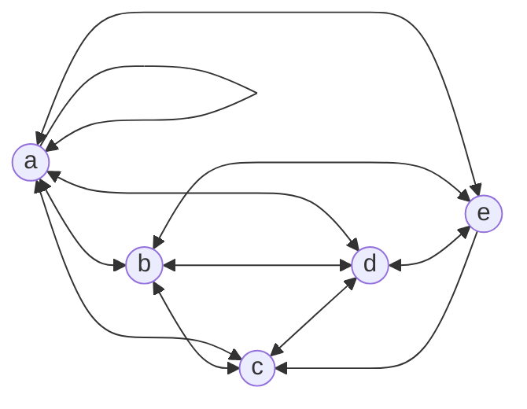
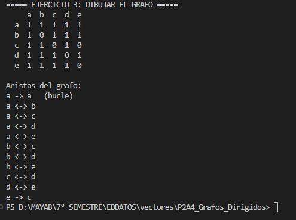

# P2A4 Grafos Dirigidos

Actividad de Estructura de Datos y Algoritmos.

Programa en Java que resuelve los 3 ejercicios de la actividad usando **matrices de adyacencia**:

1. Obtener la matriz de adyacencia de dos grafos dirigidos.
2. Analizar 4 grafos: si son conectados, cíclicos, conexos y completos; sus vértices adyacentes, caminos y grados.
3. A partir de una matriz de adyacencia, sacar las aristas para dibujar el grafo.

## Estructura

```
P2A4_Grafos_Dirigidos/
├── README.md
├── assets/                capturas de las pruebas
└── GrafosDirigidos.java
```

## Compilar y ejecutar

```bash
javac GrafosDirigidos.java && java GrafosDirigidos
```

El programa no pide datos: imprime la solución de los 3 ejercicios.

---

## Fase 1. La idea: matriz de adyacencia

Un grafo se guarda en una matriz `int[][]`. Cada fila y cada columna es un vértice:

```
     a  b  c
  a  0  1  0
  b  0  0  1
  c  1  0  0
```

- `m[fila][columna] = 1` quiere decir que hay una arista **de la fila a la columna**. En el ejemplo: `a -> b`, `b -> c` y `c -> a`.
- `0` quiere decir que no hay arista.
- Si el grafo tiene pesos, en lugar de `1` se guarda el peso.
- En un grafo **dirigido** la matriz puede no ser simétrica: que exista `a -> b` no significa que exista `b -> a`.
- En un grafo **no dirigido** la matriz siempre es simétrica: `a - b` se guarda en `m[a][b]` y en `m[b][a]`.

---

## Fase 2. Métodos básicos

### Nombre del vértice

```java
static char nombre(int i) {
    return (char) ('a' + i);
}
```

Convierte la posición en la letra del vértice: `0 -> a`, `1 -> b`, `2 -> c`... Así no hace falta guardar los nombres aparte.

### Agregar aristas

```java
static void arista(int[][] m, char origen, char destino, int peso) {
    m[origen - 'a'][destino - 'a'] = peso;
}

static void unir(int[][] m, char x, char y) {
    m[x - 'a'][y - 'a'] = 1;
    m[y - 'a'][x - 'a'] = 1;
}
```

- `origen - 'a'` hace lo contrario de `nombre`: convierte la letra en posición (`'c' - 'a' = 2`).
- `arista` es para grafos **dirigidos**: solo marca un sentido, de `origen` a `destino`, y guarda el peso.
- `unir` es para grafos **no dirigidos**: marca los dos sentidos.

### Imprimir la matriz

```java
static void imprimirMatriz(int[][] m) {
    System.out.print("   ");
    for (int j = 0; j < m.length; j++) {
        System.out.printf("%3c", nombre(j));
    }
    System.out.println();
    for (int i = 0; i < m.length; i++) {
        System.out.printf("%3c", nombre(i));
        for (int j = 0; j < m.length; j++) {
            System.out.printf("%3d", m[i][j]);
        }
        System.out.println();
    }
}
```

1. Imprime la fila de encabezado con las letras de las columnas.
2. Después imprime cada fila: primero su letra y luego sus valores.
3. `%3c` y `%3d` ocupan 3 espacios para que todo quede alineado.

---

## Fase 3. Ejercicio 1: matriz de adyacencia

### Grafo 1 (con pesos)

```java
int[][] g1 = new int[6][6];
arista(g1, 'a', 'b', 5);
arista(g1, 'a', 'e', 8);
arista(g1, 'b', 'd', 3);
arista(g1, 'b', 'e', 5);
arista(g1, 'b', 'f', 4);
arista(g1, 'c', 'a', 2);
arista(g1, 'c', 'd', 3);
arista(g1, 'd', 'e', 5);
arista(g1, 'd', 'f', 7);
arista(g1, 'e', 'c', 6);
imprimirMatriz(g1);
```

Se crea una matriz de 6 × 6 (vértices `a` a `f`) llena de ceros y se agrega cada flecha del dibujo con su peso. Resultado:

```
     a  b  c  d  e  f
  a  0  5  0  0  8  0
  b  0  0  0  3  5  4
  c  2  0  0  3  0  0
  d  0  0  0  0  5  7
  e  0  0  6  0  0  0
  f  0  0  0  0  0  0
```

- La fila `b` tiene `3`, `5` y `4` porque de `b` salen flechas a `d`, `e` y `f` con esos pesos.
- La fila `f` es toda ceros porque de `f` no sale ninguna flecha; solo le llegan.

### Grafo 2 (sin pesos)

```java
int[][] g2 = new int[6][6];
arista(g2, 'a', 'e', 1);
arista(g2, 'b', 'a', 1);
arista(g2, 'b', 'c', 1);
arista(g2, 'b', 'd', 1);
arista(g2, 'b', 'f', 1);
arista(g2, 'd', 'c', 1);
arista(g2, 'd', 'e', 1);
arista(g2, 'e', 'f', 1);
arista(g2, 'f', 'a', 1);
arista(g2, 'f', 'd', 1);
imprimirMatriz(g2);
```

Igual que el anterior, pero sin pesos: cada flecha se marca con `1`. Resultado:

```
     a  b  c  d  e  f
  a  0  0  0  0  1  0
  b  1  0  1  1  0  1
  c  0  0  0  0  0  0
  d  0  0  1  0  1  0
  e  0  0  0  0  0  1
  f  1  0  0  1  0  0
```

- `b` es el vértice del que salen más flechas (4).
- La fila `c` es toda ceros: a `c` le llegan flechas pero no sale ninguna.

### Prueba



---

## Fase 4. Ejercicio 2: métodos de análisis

Los 4 grafos de este ejercicio son **no dirigidos**, así que se arman con `unir`.

### Camino entre dos vértices

```java
static String camino(int[][] m, int origen, int destino) {
    int n = m.length;
    boolean[] visitado = new boolean[n];
    int[] padre = new int[n];
    int[] cola = new int[n];
    int inicio = 0;
    int fin = 0;

    cola[fin++] = origen;
    visitado[origen] = true;
    padre[origen] = -1;

    while (inicio < fin) {
        int actual = cola[inicio++];
        for (int j = 0; j < n; j++) {
            if (m[actual][j] == 1 && !visitado[j]) {
                visitado[j] = true;
                padre[j] = actual;
                cola[fin++] = j;
            }
        }
    }

    if (!visitado[destino]) {
        return null;
    }
    String texto = "" + nombre(destino);
    int v = padre[destino];
    while (v != -1) {
        texto = nombre(v) + " -> " + texto;
        v = padre[v];
    }
    return texto;
}
```

Es el método más importante; los demás lo usan. Hace un **recorrido en anchura (BFS)**:

1. Mete el `origen` en una cola y lo marca como visitado.
2. Mientras la cola tenga vértices, saca uno (`actual`) y mete en la cola a todos sus vecinos que no se hayan visitado.
3. En `padre[j]` guarda desde qué vértice llegó a `j`.
4. Si al terminar el `destino` no se visitó, no hay camino y regresa `null`.
5. Si sí se visitó, arma el camino **de atrás hacia adelante**, siguiendo los padres desde el destino hasta el origen.

Como nunca visita dos veces el mismo vértice, el camino que encuentra siempre es un **camino simple** (sin vértices repetidos).

### Conectada / conexa

```java
static boolean conexa(int[][] m) {
    for (int j = 1; j < m.length; j++) {
        if (camino(m, 0, j) == null) {
            return false;
        }
    }
    return true;
}
```

Una gráfica es **conectada** (o **conexa**) si hay un camino entre cualquier par de vértices. En un grafo no dirigido los dos términos significan lo mismo. Basta revisar que desde `a` se pueda llegar a todos los demás: si `a` llega a todos, cualquier vértice llega a cualquier otro pasando por `a`.

### Cíclica y camino cerrado

```java
static String buscarCiclo(int[][] m) {
    for (int i = 0; i < m.length; i++) {
        for (int j = i + 1; j < m.length; j++) {
            if (m[i][j] == 1) {
                m[i][j] = 0;
                m[j][i] = 0;
                String regreso = camino(m, j, i);
                m[i][j] = 1;
                m[j][i] = 1;
                if (regreso != null) {
                    return nombre(i) + " -> " + regreso;
                }
            }
        }
    }
    return null;
}
```

Una gráfica es **cíclica** si tiene un ciclo: un camino que regresa a donde empezó sin repetir aristas.

1. Toma una arista `i - j` y la **quita** un momento.
2. Busca si todavía hay otro camino de `j` de regreso a `i`.
3. Vuelve a poner la arista.
4. Si encontró otro camino, hay un ciclo: `i -> j -> ... -> i`.

Ejemplo con el grafo a): quita `a - b`, encuentra `b -> d -> a` y regresa el ciclo `a -> b -> d -> a`.

```java
static String idaYVuelta(int[][] m) {
    for (int i = 0; i < m.length; i++) {
        for (int j = 0; j < m.length; j++) {
            if (m[i][j] == 1) {
                return nombre(i) + " -> " + nombre(j) + " -> " + nombre(i);
            }
        }
    }
    return "No es posible";
}
```

Un **camino cerrado** es el que empieza y termina en el mismo vértice. Si el grafo tiene un ciclo, se usa ese. Si no tiene, la única forma de cerrar el camino es ir por una arista y regresar por la misma: `a -> b -> a`.

### Completa

```java
static boolean completa(int[][] m) {
    for (int i = 0; i < m.length; i++) {
        for (int j = 0; j < m.length; j++) {
            if (i != j && m[i][j] == 0) {
                return false;
            }
        }
    }
    return true;
}
```

Una gráfica es **completa** si cada vértice es adyacente a todos los demás. En la matriz, todo lo que está fuera de la diagonal tiene que ser `1`. En cuanto encuentra un `0` fuera de la diagonal, ya no es completa.

### Vértices adyacentes

```java
static String adyacentes(int[][] m) {
    String texto = "";
    for (int i = 0; i < m.length; i++) {
        for (int j = i + 1; j < m.length; j++) {
            if (m[i][j] == 1) {
                texto += "{" + nombre(i) + ", " + nombre(j) + "} ";
            }
        }
    }
    return texto;
}
```

Dos vértices son **adyacentes** si una arista los une. Recorre solo la mitad de arriba de la matriz (`j` empieza en `i + 1`), porque la matriz es simétrica y si no saldría cada par dos veces (`{a, b}` y `{b, a}`).

### Grado

```java
static int grado(int[][] m, int v) {
    int grado = 0;
    for (int j = 0; j < m.length; j++) {
        grado += m[v][j];
    }
    return grado;
}
```

El **grado** de un vértice es el número de aristas que lo tocan. En la matriz es la suma de su fila.

### Juntar todo

```java
static void analizar(String titulo, int[][] m) {
    System.out.println("\n--- Grafo " + titulo + " ---");
    imprimirMatriz(m);

    String ciclo = buscarCiclo(m);
    String ac = camino(m, 0, 2);

    System.out.println("Conectada / conexa: " + siNo(conexa(m)));
    System.out.println("Cíclica: " + siNo(ciclo != null));
    System.out.println("Completa: " + siNo(completa(m)));
    System.out.println("Vértices adyacentes: " + adyacentes(m));
    System.out.println("Camino de a a c: " + (ac == null ? "No es posible" : ac));
    System.out.println("Camino cerrado: " + (ciclo != null ? ciclo : idaYVuelta(m)));
    System.out.println("Camino simple de a a d: " + camino(m, 0, 3));
    ...
}
```

Imprime la matriz del grafo y contesta cada pregunta del ejercicio usando los métodos anteriores. `siNo` solo convierte `true`/`false` en `Sí`/`No`. Para el camino simple se eligió el par `a` y `d`, porque en los 4 grafos hay camino entre ellos.

---

## Fase 5. Ejercicio 2: resultados

### Grafo a)

```java
unir(ga, 'a', 'b');
unir(ga, 'a', 'd');
unir(ga, 'b', 'd');
```

`c` no tiene aristas.

- **Conectada / conexa:** No, porque desde `a` no se puede llegar a `c`.
- **Cíclica:** Sí, `a -> b -> d -> a`.
- **Completa:** No.
- **Adyacentes:** `{a, b} {a, d} {b, d}`.
- **Camino de a a c:** No es posible.
- **Camino cerrado:** `a -> b -> d -> a`.
- **Camino simple de a a d:** `a -> d`.
- **Grados:** a = 2, b = 2, c = 0, d = 2.



### Grafo b)

```java
unir(gb, 'a', 'b');
unir(gb, 'a', 'c');
unir(gb, 'a', 'd');
unir(gb, 'b', 'c');
unir(gb, 'b', 'd');
unir(gb, 'c', 'd');
```

Todos los vértices están unidos entre sí.

- **Conectada / conexa:** Sí.
- **Cíclica:** Sí, `a -> b -> c -> a`.
- **Completa:** Sí, es la única de las 4.
- **Adyacentes:** `{a, b} {a, c} {a, d} {b, c} {b, d} {c, d}`.
- **Camino de a a c:** `a -> c`.
- **Camino cerrado:** `a -> b -> c -> a`.
- **Camino simple de a a d:** `a -> d`.
- **Grados:** todos tienen grado 3.



### Grafo c)

```java
unir(gc, 'a', 'b');
unir(gc, 'b', 'd');
unir(gc, 'd', 'c');
```

Los vértices forman una sola línea: `a - b - d - c`.

- **Conectada / conexa:** Sí.
- **Cíclica:** No, ningún camino regresa al inicio sin repetir una arista.
- **Completa:** No.
- **Adyacentes:** `{a, b} {b, d} {c, d}`.
- **Camino de a a c:** `a -> b -> d -> c`.
- **Camino cerrado:** `a -> b -> a` (ida y vuelta por la misma arista).
- **Camino simple de a a d:** `a -> b -> d`.
- **Grados:** a = 1, b = 2, c = 1, d = 2.



### Grafo d)

```java
unir(gd, 'a', 'b');
unir(gd, 'a', 'd');
unir(gd, 'b', 'e');
unir(gd, 'e', 'c');
```

Tiene 5 vértices y forma un árbol: `d - a - b - e - c`.

- **Conectada / conexa:** Sí.
- **Cíclica:** No.
- **Completa:** No.
- **Adyacentes:** `{a, b} {a, d} {b, e} {c, e}`.
- **Camino de a a c:** `a -> b -> e -> c`.
- **Camino cerrado:** `a -> b -> a`.
- **Camino simple de a a d:** `a -> d`.
- **Grados:** a = 2, b = 2, c = 1, d = 1, e = 2.



---

## Fase 6. Ejercicio 3: dibujar el grafo

```java
int[][] g3 = {
    {1, 1, 1, 1, 1},
    {1, 0, 1, 1, 1},
    {1, 1, 0, 1, 0},
    {1, 1, 1, 0, 1},
    {1, 1, 1, 1, 0}
};
```

Se copia la matriz tal cual viene en el ejercicio.

```java
static void dibujar(int[][] m) {
    for (int i = 0; i < m.length; i++) {
        for (int j = 0; j < m.length; j++) {
            if (m[i][j] == 1) {
                if (i == j) {
                    System.out.println(nombre(i) + " -> " + nombre(i) + "   (bucle)");
                } else if (m[j][i] == 1) {
                    if (i < j) {
                        System.out.println(nombre(i) + " <-> " + nombre(j));
                    }
                } else {
                    System.out.println(nombre(i) + " -> " + nombre(j));
                }
            }
        }
    }
}
```

Revisa cada `1` de la matriz y decide qué tipo de arista es:

1. Si está en la diagonal (`i == j`), el vértice apunta a sí mismo: es un **bucle**.
2. Si también existe el `1` del otro lado (`m[j][i] == 1`), la arista va en **los dos sentidos** (`<->`). Solo se imprime una vez, cuando `i < j`.
3. Si solo existe en un sentido, es una flecha **de un solo sentido** (`->`).

Resultado:

```
a -> a   (bucle)
a <-> b
a <-> c
a <-> d
a <-> e
b <-> c
b <-> d
b <-> e
c <-> d
d <-> e
e -> c
```

- `m[a][a] = 1`, así que `a` tiene un **bucle**.
- `m[e][c] = 1` pero `m[c][e] = 0`, así que entre `c` y `e` solo hay una flecha **de e a c**. Por eso la matriz no es simétrica y el grafo es **dirigido**.
- Todas las demás parejas tienen `1` en los dos lados, así que se conectan en los dos sentidos.

### Dibujo



### Prueba


